# Cisco FMC Remediation Module for XDR

The FMC Remediation Module for XDR module in this repository integrates automated incident response
capabilities of two Cisco products:

- Cisco Secure Firewall
- Cisco eXtended Detection and Response (XDR)

This repository shows a simple example of a remediation module that can be installed in Cisco
Firepower Management Center (FMC). When adverse conditions in customer's netowrk violate a FMC
correlation policy, this module can trigger an automation workflow hosted in Cisco
XDR platform.


Here are some examples of automated incident response workflows available in XDR:

- Quarantine Endpoints in Cisco Identity Services Engine
- Block observables in Cisco Secure Firewall
- Generate Casebook and Investigate in Cisco Threat Response
- Move Computer to Triage group in Cisco Secure Endpoint
- Host Isolation with Tier2 Approval in Cisco Secure Endpoint
- Create Incident in ServiceNow
- Add to Destination List in Cisco Umbrella

This repository contains a small [example workflow](./XDR_Workflow_Example.json) that parses the
input data sent by the remediation module and triggers the **Secure Firewall - Block
Observable** workflow so that the offending source IP can be blocked by Cisco Secure Firewall
automatically in any newer attack attempts by that source IP.

## Installation

Clone the repo
```bash
git clone https://github.com/chetanph/fmc-remediation-module-xdr.git
```

Go to your project folder
```bash
cd fmc-remediation-module-xdr
```

Create remediation module package
```bash
tar -C module -czf workflow_module.tar.gz module.template trigger_workflow.py
```

### Install the package as a remediation module in FMC.

1. Navigate to **Polices -> Actions -> Modules**. Click on **Choose File** and select the
`workflow_module.tar.gz` file generated from the previous command.

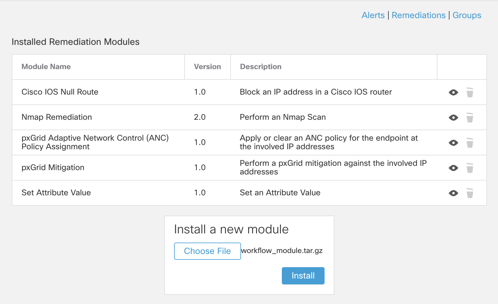

2. Once installed, click on the  icon next to
the module to view the details.

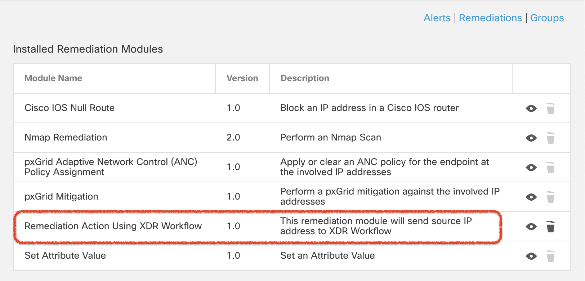

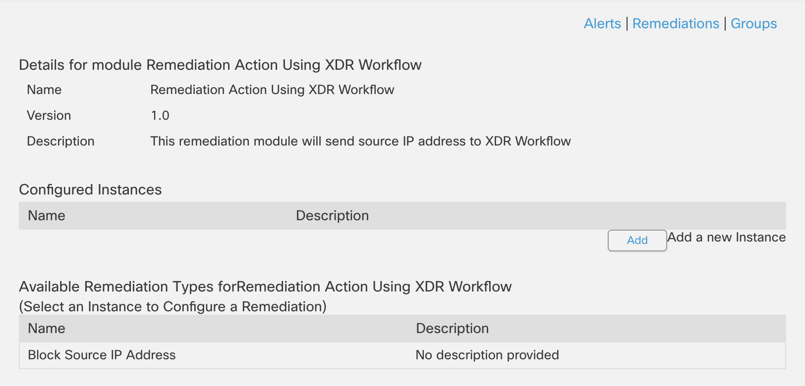

## Configuration

### Pre-requisites

A webhook URL from XDR. It should look like this:

```
https://automate.us.security.cisco.com/webhooks/{WEBHOOK_ID}?api_key={WEBHOOK_API_KEY}
```

### Create a new remediation instance in FMC.

1. On the remediation module details screen, click on **Add** button under **Configured Instances**.
Provide a name, description and **XDR Webhook URL** for the instance and click on **Create**.

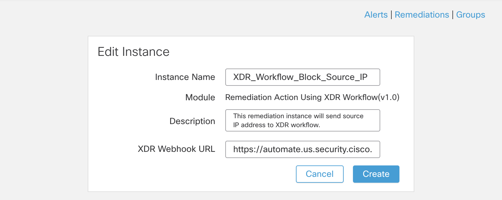

2. Click on **Add** button to add a remediation action of one of the types available from the
dropdown.

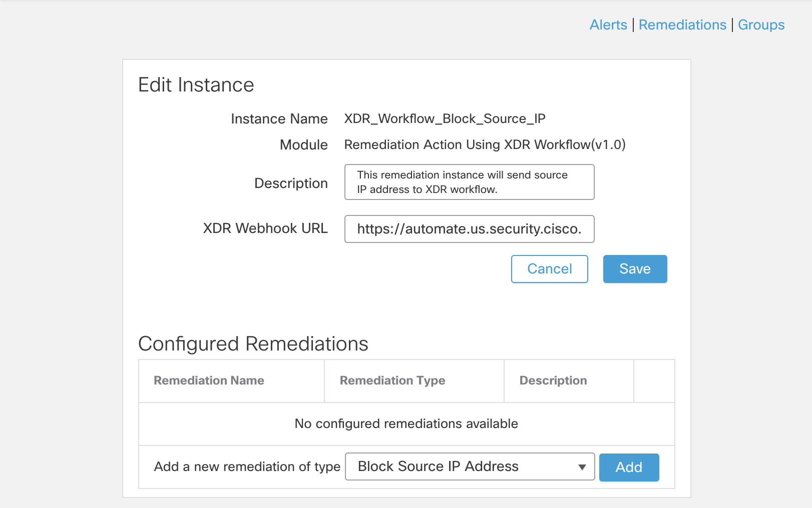

3. Provide a name and description for the remediation action and click on **Create** and then
**Save**.

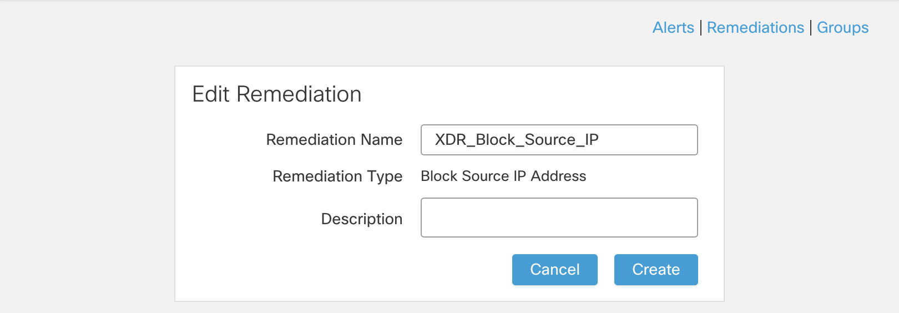

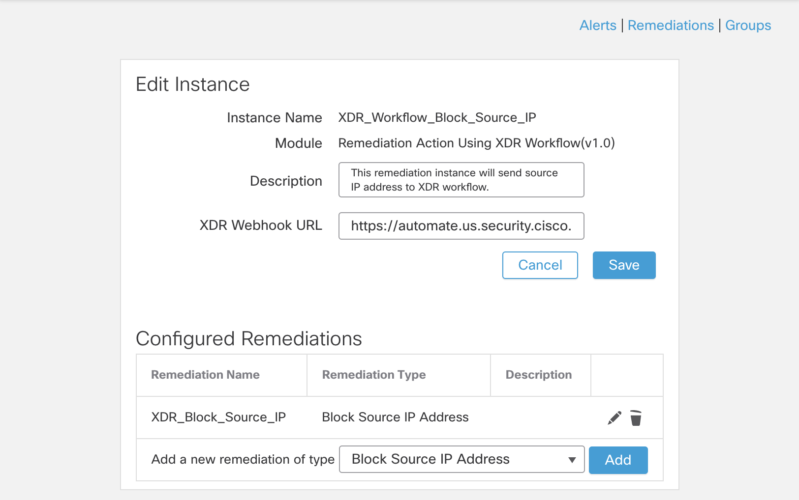

## Usage

Navigate to **Policies -> Correlation**.

### Create a correlation rule

1. Navigate to the **Rule Management** tab and click on **Create Rule** button. Provide necessary
details for the rule and click **Save**.

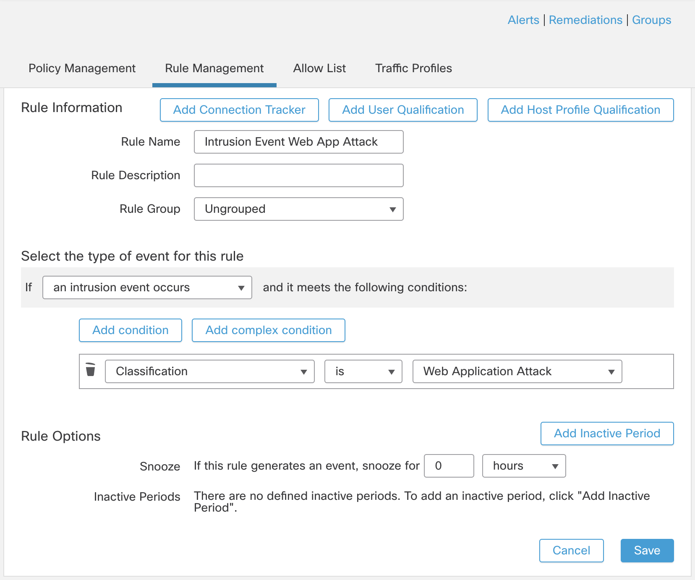

### Create a correlation policy

1. Navigate to **Policy Management** tab and click on **Create Policy**. Provide necessary details
for the policy.

2. Click on **Add Rules**, select the newly added rule and click on **Add** button.

3. Click on the  next to the rule, select the newly created
remediation action, move it to the **Assigned Responses** and save the changes.

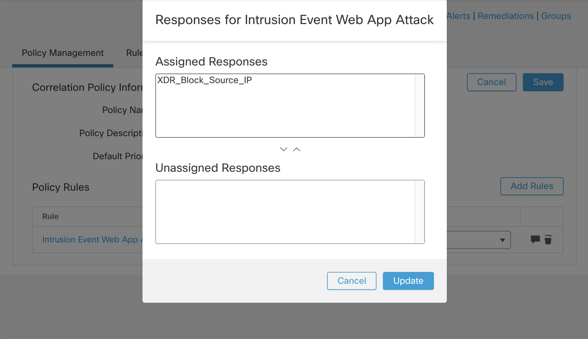

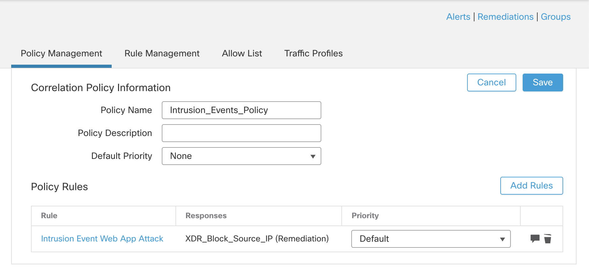

3. Activate the poilcy.

## How to test the remediation module

Generate events that triggers the correlation policy.

### Testing the module from FMC CLI.

```
[cisco@LAB-LINUX-JUMPBOX ~]$ ssh admin@LAB-FMC.example.org
Password:

Copyright 2004-2023, Cisco and/or its affiliates. All rights reserved.
Cisco is a registered trademark of Cisco Systems, Inc.
All other trademarks are property of their respective owners.

Cisco Firepower Extensible Operating System (FX-OS) v2.14.1 (build 131)
Cisco Secure Firewall Management Center for VMware v7.4.1 (build 172)

>
>
> expert
admin@LAB-FMC74:~$
admin@LAB-FMC74:~$ cd /var/sf/remediations/
admin@LAB-FMC74:/var/sf/remediations$
admin@LAB-FMC74:/var/sf/remediations$ ls -l
total 24
drwxr-s--- 2 www sfremediation 4096 Jul  2 18:35 NMap_perl_2.0
drwxr-s--- 2 www sfremediation 4096 Jul  2 18:35 SetAttrib_1.0
drwxr-s--- 2 www sfremediation 4096 Jul  8 15:11 TriggerXDRWorkflow_1.0
drwxr-s--- 2 www sfremediation 4096 Jul  2 18:35 cisco_ios_router_1.0
drwxr-s--- 2 www sfremediation 4096 Jul  2 18:35 cisco_pxgrid_1.0
drwxr-s--- 2 www sfremediation 4096 Jul  2 18:35 cisco_pxgrid_anc_1.0
admin@LAB-FMC74:/var/sf/remediations$
admin@LAB-FMC74:/var/sf/remediations$ sudo -i

We trust you have received the usual lecture from the local System
Administrator. It usually boils down to these three things:

    #1) Respect the privacy of others.
    #2) Think before you type.
    #3) With great power comes great responsibility.

Password:
root@LAB-FMC74:~#
root@LAB-FMC74:~#
root@LAB-FMC74:~# cd /var/sf/remediations/
root@LAB-FMC74:/var/sf/remediations#
root@LAB-FMC74:/var/sf/remediations# ls -l TriggerXDRWorkflow_1.0/
total 8
-r-xr-x--- 1 www sfremediation 1140 Jul  1 19:09 module.template
-r-xr-x--- 1 www sfremediation  827 Jul  1 19:32 trigger_workflow.py
root@LAB-FMC74:/var/sf/remediations#
root@LAB-FMC74:/var/sf/remediations# cd TriggerXDRWorkflow_1.0/
root@LAB-FMC74:/var/sf/remediations/TriggerXDRWorkflow_1.0#
root@LAB-FMC74:/var/sf/remediations/TriggerXDRWorkflow_1.0# ls -l
total 12
drwxrwsr-x 2 root sfremediation 4096 Jul  8 15:33 XDR_Workflow_Block_Source_IP
-r-xr-x--- 1 www  sfremediation 1140 Jul  1 19:09 module.template
-r-xr-x--- 1 www  sfremediation  827 Jul  1 19:32 trigger_workflow.py
root@LAB-FMC74:/var/sf/remediations/TriggerXDRWorkflow_1.0#
root@LAB-FMC74:/var/sf/remediations/TriggerXDRWorkflow_1.0# ls -l XDR_Workflow_Block_Source_IP/
total 4
-rw-r--r-- 1 www sfremediation 503 Jul  8 15:35 instance.conf
root@LAB-FMC74:/var/sf/remediations/TriggerXDRWorkflow_1.0#
root@LAB-FMC74:/var/sf/remediations/TriggerXDRWorkflow_1.0# cd XDR_Workflow_Block_Source_IP
root@LAB-FMC74:/var/sf/remediations/TriggerXDRWorkflow_1.0/XDR_Workflow_Block_Source_IP#
root@LAB-FMC74:/var/sf/remediations/TriggerXDRWorkflow_1.0/XDR_Workflow_Block_Source_IP# cat instance.conf
<instance name="XDR_Workflow_Block_Source_IP">
  <config>
             <string name="webhook_url">https://automate.us.security.cisco.com/webhooks/{WEBHOOK_ID}?api_key={WEBHOOK_API_KEY}</string>
  </config>
  <remediation name="XDR_Block_Source_IP" type="block_source">
    <config>
    </config>
  </remediation>
</instance>
root@LAB-FMC74:/var/sf/remediations/TriggerXDRWorkflow_1.0/XDR_Workflow_Block_Source_IP#
root@LAB-FMC74:/var/sf/remediations/TriggerXDRWorkflow_1.0/XDR_Workflow_Block_Source_IP# ../trigger_workflow.py XDR_Block_Source_IP 10.110.100.11
XDR Automation Webhook accepted data: {'remediation_name': 'XDR_Block_Source_IP', 'src_ip_addr': '10.110.100.11'}
root@LAB-FMC74:/var/sf/remediations/TriggerXDRWorkflow_1.0/XDR_Workflow_Block_Source_IP#
```

### Validating the data received in XDR workflow

This repository contains a small [example workflow](./XDR_Workflow_Example.json) that parses the
input data sent by the remediation module and triggers the **Secure Firewall - Block
Observable** workflow so that the offending source IP can be blocked by Cisco Secure Firewall
automatically in any newer attack attempts by that source IP.

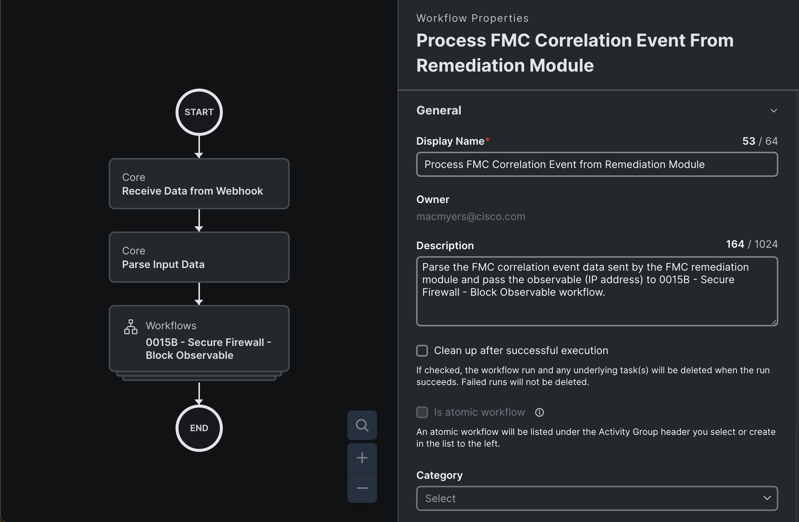

Review the workflow run triggered by the remediation module. Below screenshot shows the JSON data
received in the workflow.

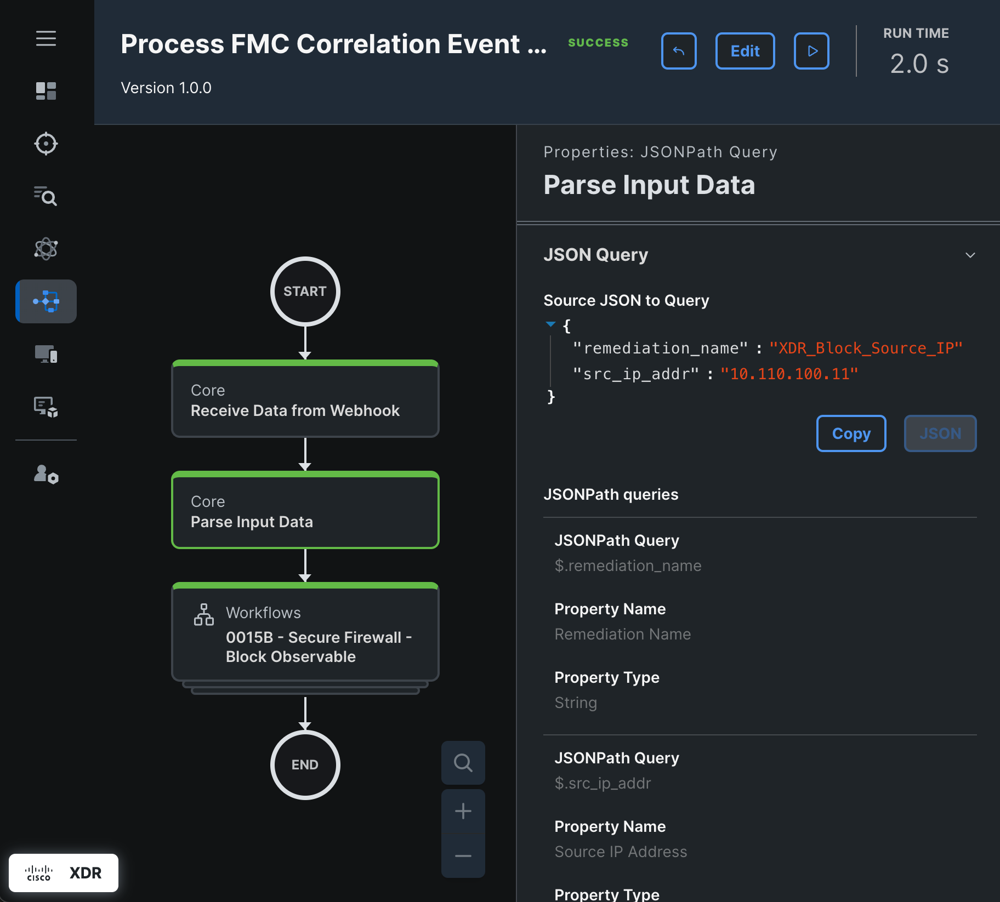

Below screenshot shows the parsed **observable** data that is sent to the **Secure Firewall - Block
Observable** workflow.

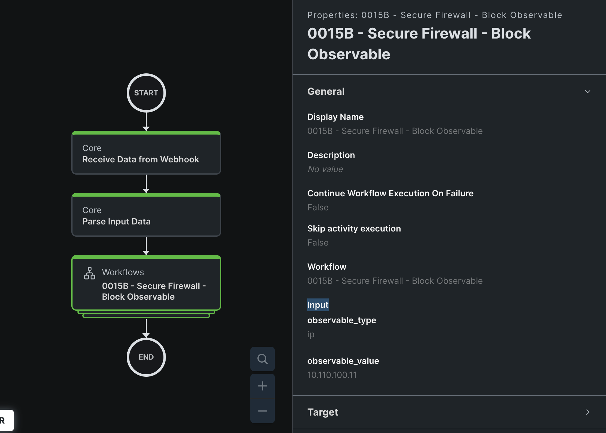

## References

* [Firepower System Remediation API Guide v6.0](https://www.cisco.com/c/en/us/td/docs/security/firepower/60/api/remediation/FireSIGHT-System-Remediation-API-Guide.html)
* [Remediation Module - Cisco Secure Workflow](https://www.cisco.com/c/en/us/td/docs/security/firepower/tetration/quick-start/guide/fmc-rm-sw-qsg.html)
* [Remediation Module - Cisco ACI](https://www.cisco.com/c/dam/en/us/td/docs/security/asa/apic/quick-start/guide/fmc-rm-qsg101-7.pdf)
* [XDR Automation Webhook](https://docs.xdr.security.cisco.com/Content/Automate/webhooks.htm)
* [XDR Automation Workflows](https://ciscosecurity.github.io/sxo-05-security-workflows/workflows/)
* [FMC 7.0 Configuration Guide - Correlation Policies](https://www.cisco.com/c/en/us/td/docs/security/firepower/70/configuration/guide/fpmc-config-guide-v70/correlation_policies.html)

### DevNet Sandbox

https://devnetsandbox.cisco.com/DevNet/catalog/firepower-mgmt-center

## Caveats

Please note that the module provided in this repository is a sample module.
Although it provides a minimum viable module that provides the functionality as described above,
it is not ready for use in a production network.

Additional development would be required to meet necessary functional and non-functional
requirements for any customer environment before the module can be used in a production network.

## Getting help

If you have questions, concerns, bug reports, etc., please create an issue against this repository.

## Getting involved

This section should detail why people should get involved and describe key areas you are currently focusing on; e.g., trying to get feedback on features, fixing certain bugs, building important pieces, etc. Include information on how to setup a development environment if different from general installation instructions.

General instructions on _how_ to contribute should be stated with a link to [CONTRIBUTING](./CONTRIBUTING.md) file.

## Author(s)

This project was written and is maintained by the following individuals:

* Chetankumar Phulpagare
