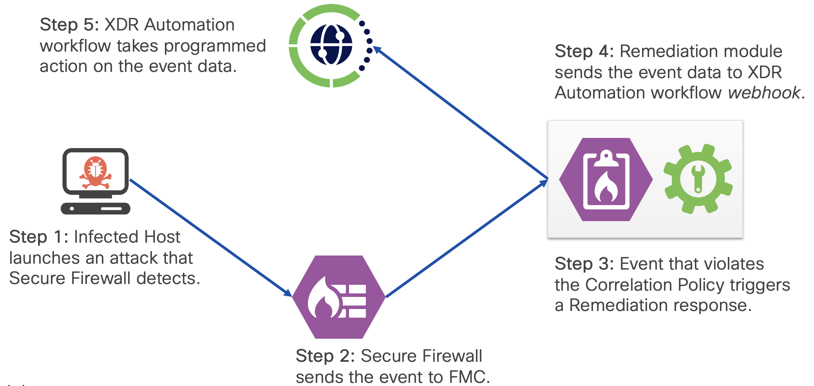

# Cisco FMC Remediation Module for XDR

This repository shows a simple example of a remediation module that can be installed in Cisco
Firepower Management Center (FMC). This module can trigger an automation workflow hosted in Cisco
eXtended Detection and Response (XDR) platform.



## Installation

Clone the repo
```bash
git clone https://github.com/chetanph/fmc-remediation-module-xdr.git
```

Go to your project folder
```bash
cd fmc-remediation-module-xdr
```

Create remediation module package
```bash
tar -C module -czf workflow_module.tar.gz module.template trigger_workflow.py
```

Install the package as a remediation module in FMC.

## Configuration

Create a new remediation instance in FMC.

## Usage

Configuration a correlation policy with a correlation rule that uses the new remediation instance as
a response action.

### DevNet Sandbox

https://devnetsandbox.cisco.com/DevNet/catalog/firepower-mgmt-center

## How to test the remediation module

Generate events that trigger the correlation policy.

## Known issues

Document any significant shortcomings with the code. If using [GitHub Issues](https://help.github.com/en/articles/about-issues) to track issues, make that known and provide any templates or conventions to be followed when opening a new issue. 

## Getting help

If you have questions, concerns, bug reports, etc., please create an issue against this repository.

## Getting involved

This section should detail why people should get involved and describe key areas you are currently focusing on; e.g., trying to get feedback on features, fixing certain bugs, building important pieces, etc. Include information on how to setup a development environment if different from general installation instructions.

General instructions on _how_ to contribute should be stated with a link to [CONTRIBUTING](./CONTRIBUTING.md) file.

## Author(s)

This project was written and is maintained by the following individuals:

* Chetankumar Phulpagare
